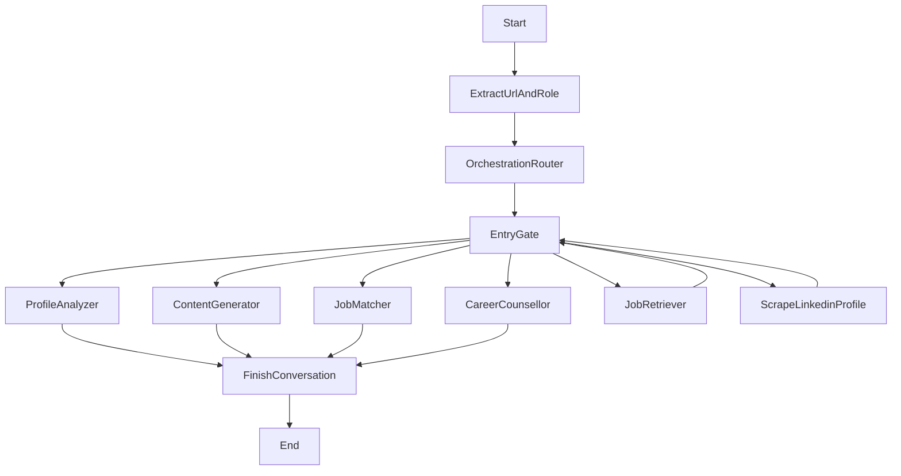

Read file: README.md
Read file: TakeHomeAssigment.txt
Read file: career_counsellor_agent.py
Read file: content_gen_agent.py
Read file: job_matcher_agent.py
Read file: multi_agent_main.py
Read file: profile_analyzer_agent.py
Read file: vectorize_pdf.py
Here is a comprehensive, industry-standard README for your project, based on the codebase, assignment requirements, and best practices:

---

# LinkedinAI

**An AI-powered multi-agent system to optimize LinkedIn profiles, analyze job fit, and provide personalized career guidance.**

---

## Table of Contents

- [Overview](#overview)
- [Features](#features)
- [System Architecture](#system-architecture)
- [Agents & Components](#agents--components)
  - [Profile Analyzer Agent](#profile-analyzer-agent)
  - [Content Generation Agent](#content-generation-agent)
  - [Job Matcher Agent](#job-matcher-agent)
  - [Career Counsellor Agent](#career-counsellor-agent)
  - [Knowledge Base Vectorization](#knowledge-base-vectorization)
- [Setup & Installation](#setup--installation)
- [Usage](#usage)
- [Extending the System](#extending-the-system)
- [Project Structure](#project-structure)
- [Approach & Design Decisions](#approach--design-decisions)
- [License](#license)

---

## Overview

**LinkedinAI** is an interactive, chat-based AI system that helps users:
- Optimize their LinkedIn profiles
- Analyze their fit for target job roles
- Receive actionable career guidance and upskilling recommendations

The system leverages a multi-agent architecture (built with [LangGraph](https://github.com/langchain-ai/langgraph) and [LangChain](https://github.com/langchain-ai/langchain)), persistent memory, and external data sources (LinkedIn, Coursera, authoritative blogs) to deliver a highly personalized and context-aware experience.

---

## Features

- **Interactive Chat Interface**: Users provide their LinkedIn profile URL and target job role; the system guides them through analysis and improvement.
- **Profile Analysis**: Section-by-section critique of LinkedIn profiles, identifying gaps, inconsistencies, and actionable improvements.
- **Job Fit Analysis**: Compares user profiles to industry-standard job descriptions, generates a match score, and suggests improvements.
- **Content Enhancement**: Rewrites profile sections to align with best practices and job-specific requirements.
- **Career Counseling & Skill Gap Analysis**: Identifies missing skills for target roles and recommends Coursera learning paths.
- **Memory System**: Maintains both session-based and persistent memory for seamless, personalized multi-turn conversations.
- **Knowledge Base Integration**: Uses a vectorized database of LinkedIn optimization resources for evidence-based recommendations.

---

## System Architecture

The system is orchestrated as a **multi-agent graph** (see `my_graph.png`):



- **Orchestration Router**: Classifies user intent and routes to the appropriate agent.
- **Entry Gate**: Ensures all prerequisites (profile, job description) are available, fetching or scraping as needed.
- **Agents**: Specialized modules for analysis, content generation, job matching, and career counseling.
- **Memory**: Both short-term (session) and long-term (persistent) memory for user context and data caching.

---

## Agents & Components

### Profile Analyzer Agent (`profile_analyzer_agent.py`)

- **Purpose**: Critiques LinkedIn profiles section-by-section (Profile Picture, Headline, About, Experience, Skills, Education, etc.).
- **Functionality**:
  - Detects missing, incomplete, or poorly written sections.
  - Provides actionable, concrete suggestions for improvement.
  - Uses Apify to scrape LinkedIn profiles and formats them for LLM analysis.

### Content Generation Agent (`content_gen_agent.py`)

- **Purpose**: Rewrites LinkedIn profile sections to align with industry best practices and target job descriptions.
- **Functionality**:
  - Analyzes job descriptions and extracts key expectations.
  - Identifies gaps and outdated language in the user profile.
  - Uses Tavily web search and a vectorized knowledge base for evidence-based rewriting.
  - Outputs succinct, recruiter-friendly profile sections.

### Job Matcher Agent (`job_matcher_agent.py`)

- **Purpose**: Evaluates how well a user's profile matches a target job role.
- **Functionality**:
  - Synthesizes industry-standard job descriptions from real-world postings.
  - Compares user profile to job requirements across multiple axes (skills, experience, domain, education, projects, soft skills).
  - Generates a structured match report with scores and reasoning.

### Career Counsellor Agent (`career_counsellor_agent.py`)

- **Purpose**: Provides personalized upskilling recommendations and learning paths.
- **Functionality**:
  - Analyzes skill gaps between the user's profile and the target job.
  - Recommends sequenced Coursera courses to bridge gaps.
  - Justifies each recommendation and organizes courses by skill track.

### Knowledge Base Vectorization (`vectorize_pdf.py`)

- **Purpose**: Builds a FAISS vector store from a curated set of LinkedIn optimization PDFs and resources.
- **Functionality**:
  - Loads and splits PDF documents.
  - Embeds text using OpenAI embeddings.
  - Enables semantic search for relevant advice during profile rewriting.

---

## Setup & Installation

### Prerequisites

- Python 3.9+
- [OpenAI API Key](https://platform.openai.com/)
- [Apify API Token](https://apify.com/)
- (Optional) [Tavily API Key](https://tavily.com/) for enhanced web search

### Installation

1. **Clone the repository:**
   ```bash
   git clone https://github.com/yourusername/LinkedinAI.git
   cd LinkedinAI
   ```

2. **Install dependencies:**
   ```bash
   pip install -r requirements.txt
   ```

3. **Set up environment variables:**
   - Create a `.env` file in the project root:
     ```
     OPENAI_API_KEY=your_openai_key
     APIFY_API_TOKEN=your_apify_token
     TAVILY_API_KEY=your_tavily_key  # Optional
     ```

4. **Vectorize the knowledge base (run once):**
   ```bash
   python vectorize_pdf.py
   ```

---

## Usage

### Local CLI (for development/testing)

Run the main orchestration script:

```bash
python multi_agent_main.py
```

- The system will prompt for your LinkedIn profile URL and target job role.
- Interact with the assistant via the command line.
- The system will guide you through profile analysis, job matching, content rewriting, and upskilling recommendations.

### Integration

- The core logic is modular and can be integrated into a web UI (e.g., Streamlit, FastAPI) for production deployment.
- The orchestration graph (`multi_agent_main.py`) exposes a `run_query()` function for programmatic access.

---

## Extending the System

- **Add new agents**: Implement new agent modules and register them in the orchestration graph.
- **Swap out vector DB**: Replace FAISS with another vector store if needed.
- **Integrate new data sources**: Add more PDF resources to `Knowledge DB/` and re-run `vectorize_pdf.py`.
- **Deploy as a web app**: Wrap the orchestration logic in a web framework for a user-friendly interface.

---

## Project Structure

```
LinkedinAI/
│
├── career_counsellor_agent.py      # Career upskilling and learning path agent
├── content_gen_agent.py            # Profile rewriting and optimization agent
├── job_matcher_agent.py            # Job fit analysis and scoring agent
├── profile_analyzer_agent.py       # Section-by-section profile critique agent
├── multi_agent_main.py             # Orchestration graph and main entry point
├── vectorize_pdf.py                # Knowledge base vectorization script
├── vectordb/                       # FAISS vector store (auto-generated)
├── Knowledge DB/                   # PDF resources for LinkedIn optimization
├── requirements.txt                # Python dependencies
├── my_graph.png                    # Visual graph of agent orchestration
├── README.md                       # Project documentation
└── TakeHomeAssigment.txt           # Assignment brief and requirements
```

---

## Approach & Design Decisions

- **Multi-Agent System**: Each agent is specialized for a distinct task, enabling modularity and extensibility.
- **Memory**: Combines session-based and persistent memory for seamless, context-aware conversations.
- **External Tools**: Integrates Apify for LinkedIn/Coursera scraping, Tavily for web search, and OpenAI for LLM-powered reasoning.
- **Evidence-Based Recommendations**: Uses a vectorized knowledge base of authoritative resources for profile optimization.
- **Prompt Engineering**: Carefully crafted system prompts for each agent to ensure high-quality, actionable outputs.
- **Orchestration Graph**: Visual and code-based representation of agent flow for maintainability and clarity.

---

## License

This project is for educational and demonstration purposes. For commercial use, please ensure compliance with the terms of the APIs and data sources used (OpenAI, Apify, Tavily, Coursera, LinkedIn, etc.).

---

**For questions, contributions, or issues, please open an issue or pull request on GitHub.**

---

*Inspired by the CareerNinja LearnTube Take-Home Assignment.*